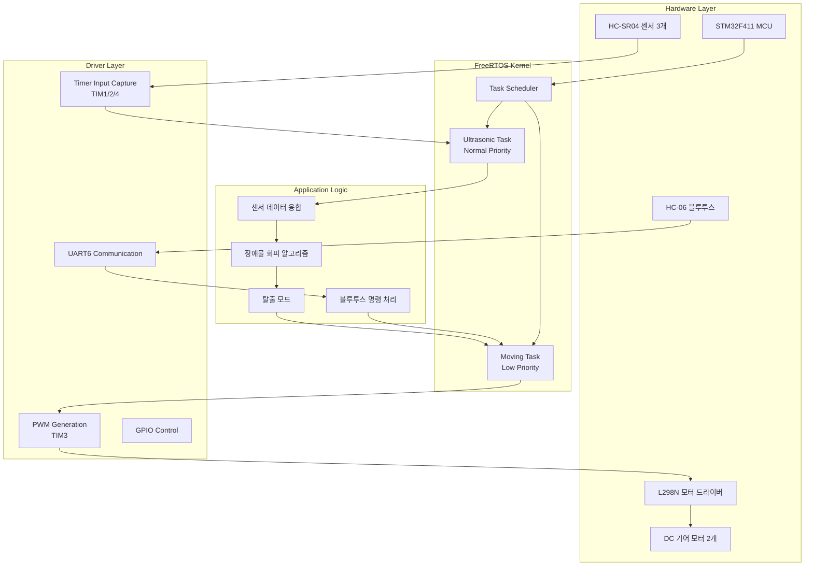

# 🚗 RTOS 자율주행 RC카 시스템

<table>
<tr>
<td width="50%">

### 자율주행 모드

### 장애물 회피

</td>
<td width="50%">
### 장애물 회피


</td>
</tr>
</table>

<div align="center">

[](https://www.st.com/en/microcontrollers-microprocessors/stm32f411.html)
[](https://www.freertos.org/)
[](https://cdn.sparkfun.com/datasheets/Sensors/Proximity/HCSR04.pdf)

**STM32CubeIDE와 FreeRTOS 기반 실시간 멀티태스킹 자율주행 RC카**

*멀티 Task 구조와 실시간 센서·모터 제어, 블루투스 무선 제어를 통한 지능형 장애물 회피 시스템*

</div>

---

## 📋 목차

- [🎯 주요 기능](#-주요-기능)
- [🏗️ 시스템 아키텍처](#️-시스템-아키텍처)
- [🚀 설치 및 실행](#-설치-및-실행)
- [📖 사용법](#-사용법)
- [⚙️ 하드웨어 구성](#️-하드웨어-구성)
- [🎛️ 제어 명령어](#️-제어-명령어)
- [📊 성능 정보](#-성능-정보)
- [🔧 문제해결](#-문제해결)
- [🛠️ 개발 정보](#️-개발-정보)
- [🤝 기여하기](#-기여하기)
- [📞 연락처](#-연락처)

---

## 🎯 주요 기능

### 🤖 실시간 멀티태스킹 시스템
- **FreeRTOS 기반**: 우선순위 스케줄링으로 센서와 제어 로직 분리
- **Ultrasonic Task**: 3개 초음파 센서(HC-SR04) 실시간 거리 측정
- **Moving Task**: 블루투스 명령 수신 및 자율주행 로직 처리
- **Task 우선순위**: 센서 → 제어 → 통신 순으로 실시간성 보장

### 🚗 지능형 자율주행
- **360도 장애물 감지**: 전방, 좌측, 우측 초음파 센서 기반 환경 인식
- **스마트 장애물 회피**: 3방향 센서 데이터 융합으로 최적 경로 결정
- **지능형 탈출 알고리즘**: 복잡한 미로 환경에서 막힌 상황 감지 및 탈출
- **PWM 정밀 제어**: 좌우 모터 독립 제어로 부드러운 조향 구현

### 📱 블루투스 원격 제어
- **HC-06/05 모듈**: UART6 기반 안정적 무선 통신
- **수동 제어 모드**: 전진/후진/좌회전/우회전/정지 명령 지원
- **자동 모드 전환**: 실시간 모드 변경 및 상태 피드백
- **실시간 명령 처리**: 지연 없는 즉시 반응 시스템

### 🔧 고급 센서 제어
- **Timer Input Capture**: TIM1/2/4를 활용한 정밀한 거리 측정
- **PWM 모터 드라이버**: TIM3 기반 속도 및 방향 제어
- **시스템 타이머**: TIM11을 활용한 1ms tick FreeRTOS 운영

---

## 🏗️ 시스템 아키텍처



### 📁 프로젝트 구조

```
RTOS_RC_CAR/
├── Inc/                          # 헤더 파일
│   ├── FreeRTOSConfig.h         # FreeRTOS 설정
│   ├── main.h                   # 메인 헤더
│   ├── ultrasonic.h             # 센서/모터 제어 헤더
│   └── stm32f4xx_hal_conf.h     # HAL 라이브러리 설정
├── Src/                          # 소스 파일
│   ├── main.c                   # 메인 함수, 하드웨어 초기화
│   ├── freertos.c               # Task 정의 및 스케줄러
│   ├── ultrasonic.c             # 센서 및 모터 제어 로직
│   ├── stm32f4xx_hal_msp.c      # MSP 초기화
│   └── stm32f4xx_it.c           # 인터럽트 핸들러
├── Drivers/                      # STM32 HAL 드라이버
├── Middlewares/                  # FreeRTOS 소스
└── README.md                     # 프로젝트 설명
```

---

## 🚀 설치 및 실행

### 📋 시스템 요구사항

| 구분      | 요구사항                    |
|-----------|---------------------------|
| MCU       | STM32F411 (ARM Cortex-M4) |
| IDE       | STM32CubeIDE              |
| RTOS      | FreeRTOS v10.3.1          |
| 센서      | HC-SR04 초음파 센서 3개    |
| 모터      | DC 기어 모터 2개          |
| 통신      | HC-06/05 블루투스 모듈     |

### ⚡ 하드웨어 연결

```
STM32F411 핀맵:
┌─────────────────────────────────────┐
│ 초음파 센서 (HC-SR04)                │
│ - 우측 센서: PA8(Trig), PA15(Echo)   │
│ - 중앙 센서: PA9(Trig), PB3(Echo)    │
│ - 좌측 센서: PA10(Trig), PB4(Echo)   │
├─────────────────────────────────────┤
│ 모터 드라이버 (L298N)                │
│ - 좌측 모터: PA0(PWM), PA1(DIR)      │
│ - 우측 모터: PA2(PWM), PA3(DIR)      │
├─────────────────────────────────────┤
│ 블루투스 (HC-06)                     │
│ - UART6: PC6(TX), PC7(RX)           │
└─────────────────────────────────────┘
```

### 설치 과정

1. **저장소 복제**
```bash
git clone https://github.com/juntaek-oh/RTOS_RC_CAR.git
cd RTOS_RC_CAR
```

2. **STM32CubeIDE 프로젝트 가져오기**
```bash
# STM32CubeIDE 실행
File → Import → General → Existing Projects into Workspace
Browse → RTOS_RC_CAR 폴더 선택 → Import
```

3. **하드웨어 연결 확인**
- STM32F411 보드와 센서/모터 연결
- HC-06 블루투스 모듈 페어링 (기본 PIN: 1234)
- 전원 공급 확인 (5V, 충분한 전류 공급)

### ▶️ 실행 방법

**빌드 및 업로드**
```bash
# STM32CubeIDE에서
1. Project → Build Project (Ctrl+B)
2. Run → Debug As → STM32 MCU C/C++ Application
3. 또는 Run → Run As → STM32 MCU C/C++ Application
```

---

## 📖 사용법

### 자율주행 모드
블루투스로 'Z' 명령을 보내면 자율주행이 시작됩니다.

```
┌─────────────────────────────────────────────┐
│ 🤖 AUTO MODE | 센서: OK | 모터: ACTIVE     │
├─────────────────────────────────────────────┤
│                                             │
│    전방 센서: 15cm  🚧                      │
│    좌측 센서: 8cm   ←                       │
│    우측 센서: 25cm  →                       │
│                                             │
│    판정: 우회전 실행                         │
│    상태: 장애물 회피 중                      │
│                                             │
└─────────────────────────────────────────────┘
   블루투스 연결 상태: ✅ 명령 대기 중
```

### 수동 제어 모드
블루투스 앱을 통해 직접 RC카를 조종할 수 있습니다.

---

## ⚙️ 하드웨어 구성

### MCU 및 개발환경
- **STM32F411**: ARM Cortex-M4, 100MHz, 512KB Flash
- **STM32CubeIDE**: 통합 개발 환경
- **HAL/LL 드라이버**: 하드웨어 추상화 계층
- **RTOS-aware 디버깅**: 실시간 Task 상태 모니터링

### 센서 시스템
- **HC-SR04 초음파 센서**: 2cm~400cm 측정 범위
- **Timer Input Capture**: ±1mm 정밀도 거리 측정
- **3방향 배치**: 전방, 좌측, 우측 장애물 동시 감지

### 구동 시스템
- **L298N 모터 드라이버**: 최대 2A, 양방향 제어
- **DC 기어 모터**: 감속비 1:48, 토크 최적화
- **PWM 제어**: 0-1000 범위, 정밀한 속도 조절

### 통신 모듈
- **HC-06 블루투스**: UART 기반, 안정적 연결
- **통신 속도**: 9600 baud, 실시간 명령 처리

---

## 🎛️ 제어 명령어

### 수동 모드 명령어
- **F**: 전진 (PWM 400)
- **B**: 후진 (PWM 400)  
- **L**: 좌회전 (PWM 850)
- **R**: 우회전 (PWM 850)
- **S**: 정지 (PWM 0)
- **Z**: 자동 모드 활성화

### 자동 모드 동작
- **센서 기반 자율주행**: 실시간 환경 인식
- **장애물 감지**: 20cm 이내 장애물 자동 회피  
- **탈출 알고리즘**: 막힌 상황에서 후진-회전 시퀀스
- **경로 최적화**: 가장 넓은 공간으로 이동

---

## 📊 성능 정보

### 실시간 성능 지표

| 항목              | 성능              | 비고                    |
|-------------------|-------------------|-------------------------|
| 센서 측정 주기     | 100ms             | Ultrasonic Task        |
| 제어 응답 시간     | 50ms              | Moving Task            |
| 블루투스 지연      | <100ms            | UART6 기반             |
| 자율주행 정확도    | 90% 이상          | 다양한 환경 테스트     |

### Task 우선순위 및 스택 크기

```c
// FreeRTOS Task 설정
Ultrasonic_Task:  Normal Priority (24), Stack: 128 words
Moving_Task:      Low Priority (23),    Stack: 128 words
System Tick:      1ms, TIM11 기반
```

### 센서 정밀도
- **측정 범위**: 2cm ~ 400cm
- **정확도**: ±3mm (20cm 이내), ±1% (20cm 초과)
- **응답 시간**: 60ms per sensor
- **동시 측정**: 3개 센서 병렬 처리

---

## 🔧 문제해결

### 일반적인 문제들

- **센서 인식 불량**  
  `Timer Input Capture 오동작`  
  → 센서 전원 연결 및 핀맵 확인, Pull-up 저항 체크

- **모터 작동 불안정**  
  `PWM 신호 불안정`  
  → L298N 드라이버 전원 공급 상태 확인, 모터 연결 점검

- **블루투스 연결 실패**  
  `UART 통신 오류`  
  → HC-06 페어링 재시도, Baud rate 확인 (9600)

- **자율주행 성능 저하**  
  → 센서 청소, 바닥 재질 확인, 조명 환경 조정

### 디버깅 방법

```c
// STM32CubeIDE 디버깅 옵션
1. Debug Configuration → STM32 Application
2. Debugger tab → Enable "FreeRTOS" support
3. Run → Debug → Task 상태 실시간 모니터링
4. Live Expressions로 센서값 실시간 확인
```

---

## 🛠️ 개발 정보

### 핵심 기술 구현

**센서 제어 알고리즘**
```c
// 초음파 센서 Task (Normal Priority)
void Ultrasonic_01(void *argument) {
    for(;;) {
        HCSR04_Trigger1(); // 우측 센서
        HCSR04_Trigger2(); // 중앙 센서  
        HCSR04_Trigger3(); // 좌측 센서
        
        osDelay(100); // 100ms 주기
    }
}
```

**자율주행 로직**
```c
// 모터 제어 Task (Low Priority)
void Moving_01(void *argument) {
    for(;;) {
        if (isAutoMode) {
            // 3방향 센서 데이터 분석
            // 최적 경로 결정 알고리즘
            // 장애물 회피 및 탈출 모드
            moving();
        }
        processBluetoothCommand();
        osDelay(50); // 50ms 주기
    }
}
```

### 최적화 기법
- **멀티태스킹 분리**: 센서 측정과 제어 로직 병렬 처리
- **우선순위 스케줄링**: 실시간성이 중요한 Task 우선 실행  
- **Timer 하드웨어 활용**: 소프트웨어 지연 없는 정밀 측정
- **모듈화된 코드**: 기능별 분리로 확장성 및 유지보수성 향상

### 향후 개발 계획
- **카메라 모듈 추가**: OpenCV 기반 영상 인식
- **WiFi 연동**: ESP32 기반 원격 모니터링
- **GPS 모듈**: 절대 위치 기반 경로 계획
- **AI 알고리즘**: 강화학습 기반 자율주행 최적화

---

## 🤝 기여하기

1. 프로젝트 Fork
2. Feature Branch 생성 (`git checkout -b feature/AmazingFeature`)
3. 커밋 (`git commit -m 'Add some AmazingFeature'`)
4. 브랜치 푸시 (`git push origin feature/AmazingFeature`)
5. Pull Request 생성

### 🐛 버그 리포트

Issues 탭에 다음 정보를 포함해 제출해주세요:
- STM32 보드 모델 및 IDE 버전
- FreeRTOS 및 HAL 라이브러리 버전  
- 하드웨어 연결 상태
- 에러 메시지 및 로그
- 재현 가능한 단계별 설명

---

## 📞 연락처

- **개발자**: 오준택
- **이메일**: [ojt8416@gmail.com](mailto:ojt8416@gmail.com)
- **GitHub**: [@juntaek-oh](https://github.com/juntaek-oh)
- **프로젝트 링크**: [https://github.com/juntaek-oh/RTOS_RC_CAR](https://github.com/juntaek-oh/RTOS_RC_CAR)

---

<div align="center">

## 🚗 임베디드 시스템의 새로운 경험, RTOS RC카와 함께하세요! 🚗
**STM32CubeIDE와 FreeRTOS 멀티태스킹으로 구현한 실시간 자율주행 시스템**

⭐ 도움 되셨다면 Star 부탁드립니다! ⭐

</div>
